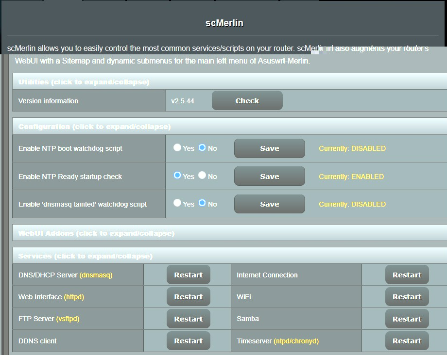
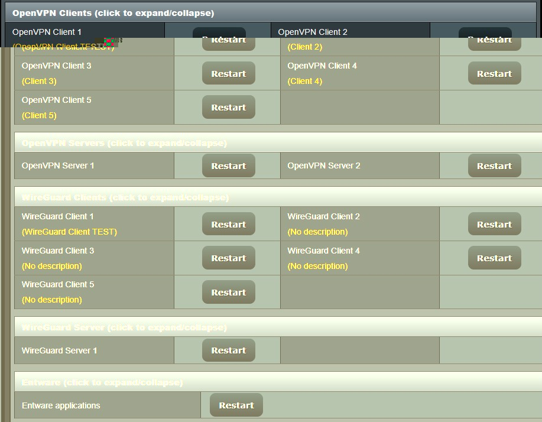
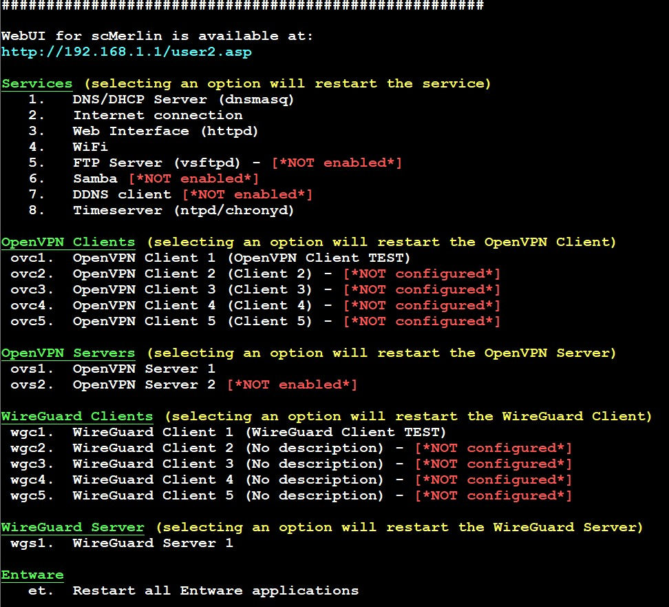

# scMerlin

## v2.5.46
### Updated on 2025-Dec-05

## About
scMerlin allows you to easily control the most common services/scripts on your router. scMerlin also augments your router's WebUI with a Sitemap and dynamic submenus for the main left menu of Asuswrt-Merlin.

scMerlin is free to use under the [GNU General Public License version 3](https://opensource.org/licenses/GPL-3.0) (GPL 3.0).

## Installation
scMerlin is available to install with [amtm - the Asuswrt-Merlin Terminal Menu](https://github.com/decoderman/amtm)
Using your preferred SSH client/terminal, open amtm and use the i install option to install scMerlin:
```sh
amtm
```
Or using your preferred SSH client/terminal, copy and paste the following command, then press Enter:

```sh
/usr/sbin/curl --retry 3 "https://raw.githubusercontent.com/AMTM-OSR/scmerlin/master/scmerlin.sh" -o "/jffs/scripts/scmerlin" && chmod 0755 /jffs/scripts/scmerlin && /jffs/scripts/scmerlin install
```

## Prerequisites
1. [Asuswrt-Merlin](https://asuswrt.lostrealm.ca/ "Pure Freaking Magic") running on a supported ASUS router
2. **Entware** (optional but recommended), preferably installed via [amtm](https://github.com/decoderman/amtm "amtm"), to enable enhanced features and functionality
3. jffs scripts enabled in the firmware; this can be set manually, and installing **Entware** via amtm usually takes care of it

## Supported firmware versions
You must be running firmware Merlin 384.15/384.13_4 or Fork 43E5 (or later) [Asuswrt-Merlin](https://asuswrt.lostrealm.ca/)

## Usage
### WebUI
scMerlin can be used via the WebUI, in the Addons section.





### Command Line
To launch the scMerlin menu after installation, use:
```sh
scmerlin
```

If this does not work, you will need to use the full path:
```sh
/jffs/scripts/scmerlin
```




## NOTE:
The "Services" and "VPN" sections on the WebUI page have the option to send a request to "restart" a selected service. However, that does not mean that the service is currently enabled or configured to be started.

When clicking on the "Restart" button for a service, the WebUI makes a call to the script to check and then send the appropriate command(s) to restart the selected service or VPN; but the requested command(s) may not actually be sent if it's determined that the selected service is ***not*** enabled, or if the VPN client/server is ***not*** actually configured to be started, in which case the WebUI will respond by displaying a message indicating that the service is **DISABLED** and therefore was **NOT** restarted.


## Help
Please post about any issues and problems here: [Asuswrt-Merlin AddOns on SNBForums](https://www.snbforums.com/forums/asuswrt-merlin-addons.60/?prefix_id=23)
